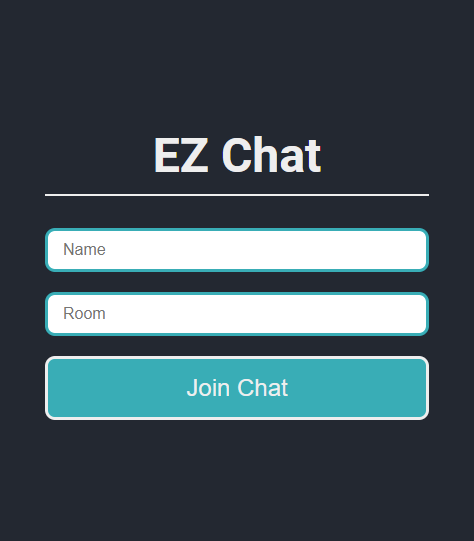
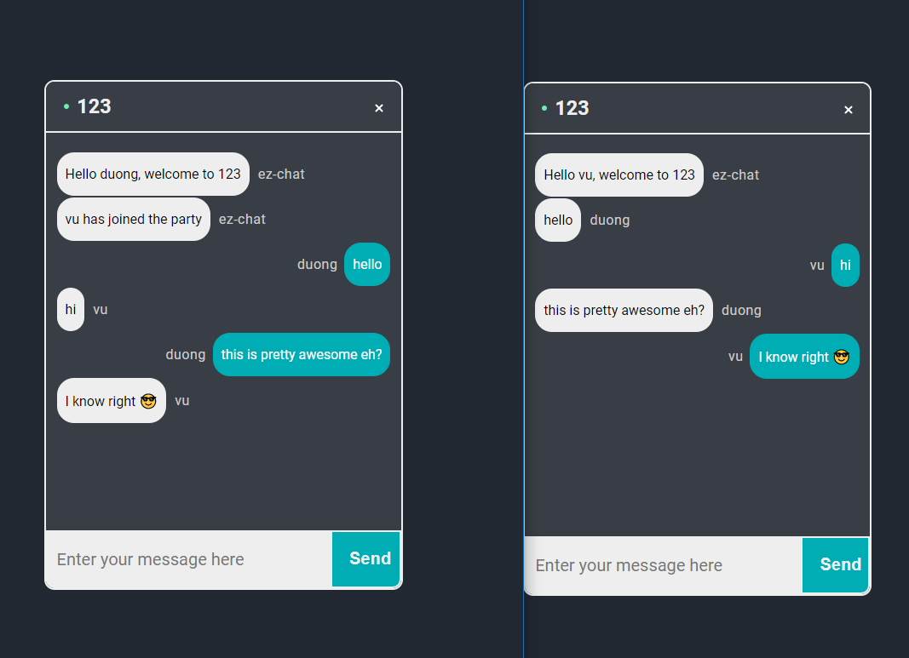

# ez-chat2
Web application for chatting with friends and family.

---

### Try it out
ez-chat2 is [LIVE](https://ez-chat2.netlify.app/)!

---

### Features

- Setting usernames.
- Joining and leaving chat rooms.
- Sending and receiving messages in real-time.
- Emojis support for messages.

---

### Technologies

- Back-end:

- Front-end:
 

---

### Local dev server

To host and run a local version of ez-chat2:

    1. Clone the repository with "git clone --recursive https://github.com/ThaiDuongVu/ez-chat2.git"
    2. cd to ez-chat2 directory.
    3. Start local server with "npm start".
    4. With a different terminal, cd into ./client directory inside ez-chat2.
    5. Start React app with "npm start".
    6. Enjoy chatting!

